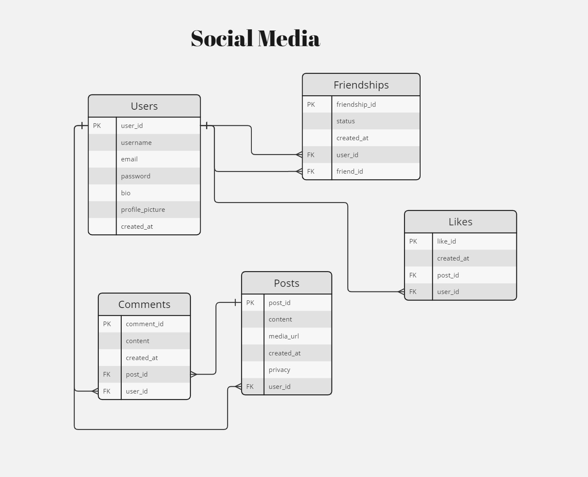

# Social Media Database Project

## Project Overview

This project involves designing and implementing a relational database for a social media platform. The database stores information about users, friendships, posts, comments, likes, and notifications. It provides a structured way to manage user interactions and content within the platform.

## Database Schema

The database schema consists of the following tables:

<ol>
    <li>
        <strong>Users:</strong> Stores information about users, including their usernames, email addresses, passwords, bios, profile pictures, and creation timestamps.
    </li>
    <li>
        <strong>Friendships:</strong> Tracks the relationships between users, including friendship status and creation timestamps.
    </li>
    <li>
        <strong>Posts:</strong> Contains posts created by users, along with their content, media URLs, creation timestamps, and privacy settings.
    </li>
    <li>
        <strong>Comments:</strong> Stores comments made by users on posts, including the content of the comments and their creation timestamps.
    </li>
    <li>
        <strong>Likes:</strong> Tracks likes given by users on posts, including the timestamps of the likes.
    </li>
    <li>
        <strong>Notifications:</strong> Records notifications for user activities, including the type of notification, related post/comment ID, read status, and creation timestamp.
    </li>
</ol>

## Getting Started
<ol>
    <li>Clone the repository to your local machine.</li>
    <li>Import the SQL script (`social_media_database.sql`) into your MySQL database management tool (e.g., MySQL Workbench).</li>
    <li>Modify the script or database schema as needed to suit your specific requirements.</li>
    <li>Start querying and interacting with the database using SQL commands or through your application.</li>
</ol>

## ER Diagram

The Entity-Relationship (ER) diagram for the social media database visually represents the structure of the database, including entities, attributes, and relationships between them. Refer to the ER diagram section for a detailed illustration of the database schema.

  

<footer>
    
&copy; 2024 Social Media Database Project

</footer>
